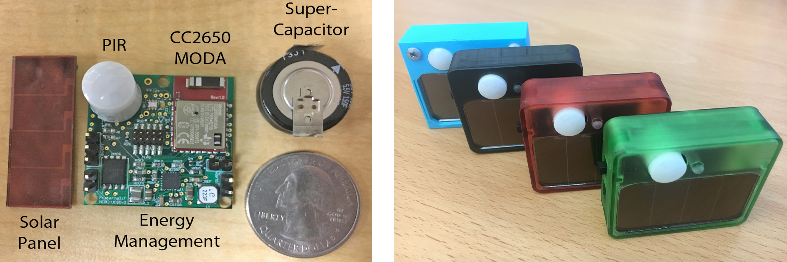

# Pible
Pible is a battery-free mote for Perpetual Indoor BLE applications. It leverages indoor light to harvest energy from the environment and store it in a super-capacitor. The current version exploits a 1.5F supercapacitor that can store an amount of energy that can allow simple sensing indoor operations (i.e. temperature) for more than 10 days. It can be used for a general set of indoor applications since it embeds the following sensors:
- Temperature & Humidity (HDC1000)
- Light (OPT3001)
- Barometer (BMP280)
- Accelerometer & Gyroscope & Magnetometer (MPU-9250)
- Reed Switch
- Motion Sensor (Passive Infrared Sensor from Panasonic)
- Microphone (SPH0641LU4H-1)

It mounts the TI CC2650MODA that can be configured for Bluethoot Low Energy transmissions (i.e. BLE) and exploited for beaconing.

# Simulator:
Inside the "simulator" folder you can run "pible_simulator.py" that simulates Pible lifetime based on energy gathered and operations executed. To check how Pible behaves under different environments, open the file and modify at the top of it the parameters such as light intensity, PIR events to detect etc. Enjoy!
